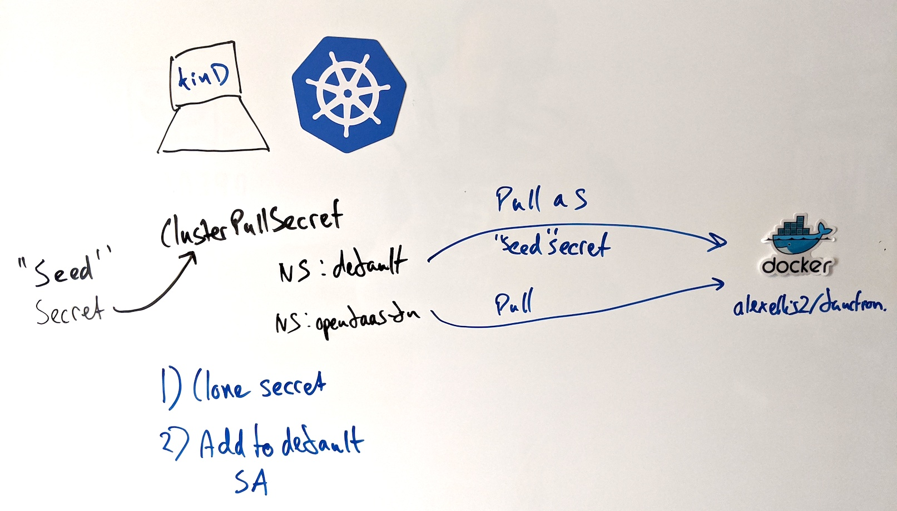

## Installation



> Conceptual diagram: registry-creds operator

* The operator requires CRUD permission on secrets within all namespaces, and uses a ClusterRole.
* A custom resource is also installed called `ClusterPullSecret`, scoped to the global cluster level.
* You'll create a "seed secret", which the ClusterPullSecret will point to
* The operator will clone your seed secret to each namespace, and append it to the default ServiceAccount's imagePullSecrets list

## Usage

### Option A) Configuration with kubectl

Apply the YAML for the manifest.

```bash
kubectl apply -f https://raw.githubusercontent.com/alexellis/registry-creds/master/manifest.yaml
```

Next, you'll need to create a seed secret and `ClusterPullSecret` referencing it.

Create a "seed" secret so that it can be referenced by the ClusterPullSecret. You can customise the name, and namespace as per your own preference.

```bash
export DOCKER_USERNAME=username
export DOCKER_PASSWORD=mypassword
export DOCKER_EMAIL=me@example.com

kubectl create secret docker-registry registry-creds \
  --namespace kube-system \
  --docker-username=$DOCKER_USERNAME \
  --docker-password=$DOCKER_PASSWORD \
  --docker-email=$DOCKER_EMAIL
```

If you're not using the Docker Hub, then add `--docker-server`

Now create a `ClusterPullSecret` YAML file. This is a cluster-scoped resource, so you cannot specify a namespace for it. Populate `secretRef` with the secret name and namespace from above. This is the secret that will be copied to each namespace.

```yaml
apiVersion: ops.alexellis.io/v1
kind: ClusterPullSecret
metadata:
  name: dockerhub-registry-creds
spec:
  secretRef:
    name: registry-creds
    namespace: kube-system
```

### Option B) Configuration with arkade

Create an environment file i.e. `~/.docker-creds`, so that you are not having to keep typing passwords in.

```bash
export DOCKER_USERNAME=username
export DOCKER_PASSWORD=password
export DOCKER_EMAIL=email

# Optional
export DOCKER_SERVER=""
```

Then run this command on any of your clusters

```bash
source ~/.docker-creds
arkade install registry-creds --from-env
```

Or specify each flag:

```bash
arkade install registry-creds \
  --username "${DOCKER_USERNAME}" \
  --password "${DOCKER_PASSWORD}" \
  --email  "${DOCKER_EMAIL}"
```

> Optionally, you can also pass `--server`

### Running the tool locally for development

You can use the [arkade project](https://get-arkade.dev) to get CLIs the easy way, or find your way to the releases page of each application required.

If you don't have a local Kubernetes cluster, you can create one with k3d, or KinD

```bash
arkade get kind
kind create cluster
```

Get the pre-reqs: kubectl and kustomize

```bash
arkade get kubectl
arkade get kustomize
```

Install with:

```bash
git clone https://github.com/alexellis/registry-creds
cd registry-creds
make install
make run
```

> Note, you can also run `make install deploy` to try running in-cluster.

### Rotate your seed secret and `ClusterPullSecret`

If you want to update your `ClusterPullSecret`, then update your main "seed" secret, delete the `ClusterPullSecret` entry, and create it again. The owner references will garbage collect the older secrets and re-create them again.

### Exclude a namespace from being updated

Disable:

```bash
kubectl create ns alex
kubectl annotate ns alex alexellis.io/registry-creds.ignore=1
```

Enable:

```bash
kubectl annotate ns alex alexellis.io/registry-creds.ignore=0 --overwrite
```

## Testing it out

Do you want to see it all in action, but don't have time to waste? You're in luck, [OpenFaaS](https://www.openfaas.com/) provides a very easy to use workflow for creating a quick Docker image that servers HTTP traffic, and that can be deployed to Kubernetes.

The easiest way to test the controller is with a private image on the Docker Hub, but you can also use the [arkade project](https://get-arkade.dev) to install a self-hosted registry, with authentication enabled and TLS.

```bash
arkade install ingress-nginx
arkade install cert-manager

arkade install docker-registry
arkade install docker-registry-ingress \
 --email me@example.com \
 --domain reg.example.com
```

Run the above on a computer with a public IP, or use the [inlets-operator](https://github.com/inlets/inlets-operator) to expose your local registry on the Internet, and to get a TLS certificate for it.

Then go ahead and deploy something like OpenFaaS, create a function, and push it to your registry.

```bash
# Get the OpenFaaS CLI, and put it in `PATH`
arkade get faas-cli

# Install openfaas, and follow the login instructions
arkade install openfaas

# Create a new function and push it to your registry
faas-cli new --lang go --prefix reg.example.com/functions awesome-api
faas-cli up -f awesome-api.yml
```

You'll see `reg.example.com/functions/awesome-api:latest` being built, pushed and deployed to your cluster.

Check the event-stream to see the image being pulled and started:

```bash
kubectl get event -n openfaas-fn -w

LAST SEEN   TYPE     REASON              OBJECT                      MESSAGE
8s          Normal   Scheduled           pod/api-577d87c687-knd54    Successfully assigned openfaas-fn/api-577d87c687-knd54 to kind-control-plane
7s          Normal   Pulling             pod/api-577d87c687-knd54    Pulling image "alexellis2/http-api"
8s          Normal   SuccessfulCreate    replicaset/api-577d87c687   Created pod: api-577d87c687-knd54
8s          Normal   ScalingReplicaSet   deployment/api              Scaled up replica set api-577d87c687 to 1
0s          Normal   Pulled              pod/api-577d87c687-knd54    Successfully pulled image "alexellis2/http-api"
0s          Normal   Created             pod/api-577d87c687-knd54    Created container api
0s          Normal   Started             pod/api-577d87c687-knd54    Started container api
```

## Appendix

Terraform:

* [Snippet to imperatively apply a secret throughout your cluster](https://gist.github.com/phumberdroz/81885c01c2207d578c17635afce1b033) by Pierre Humberdroz

Tools to manage Kubernetes configuration, declaratively:

* [ArgoCD](https://argoproj.github.io/argo-cd/) - install via `arkade install argocd`
* [Flux](https://fluxcd.io)

Pull-through caching registries:

* [Preparing Google Cloud deployments for Docker Hub pull request limits](https://cloud.google.com/blog/products/containers-kubernetes/mitigating-the-impact-of-new-docker-hub-pull-request-limits)
* [Registry as a pull through cache](https://docs.docker.com/registry/recipes/mirror/)
